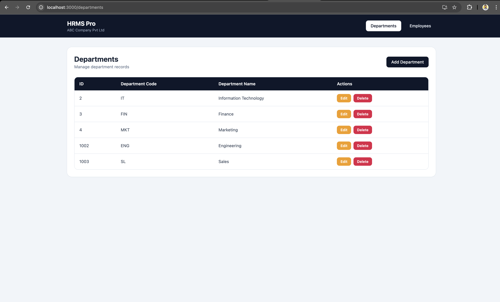
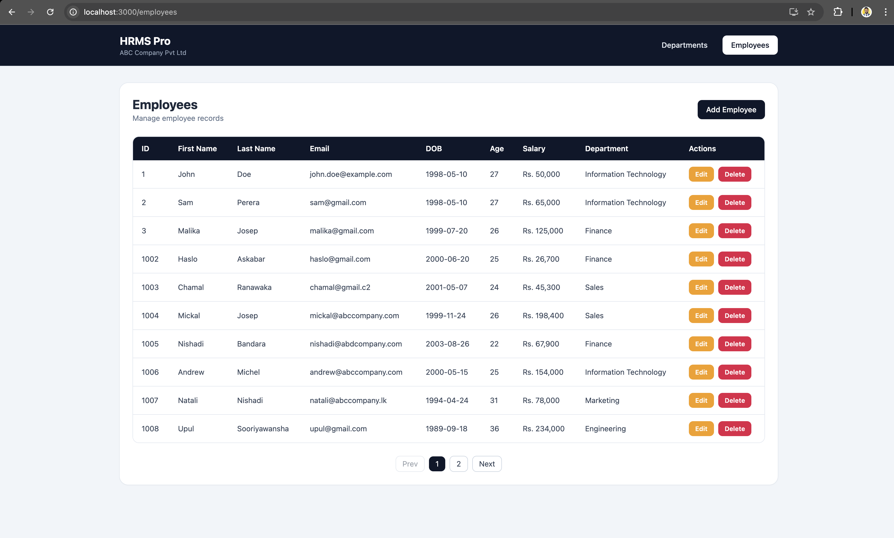
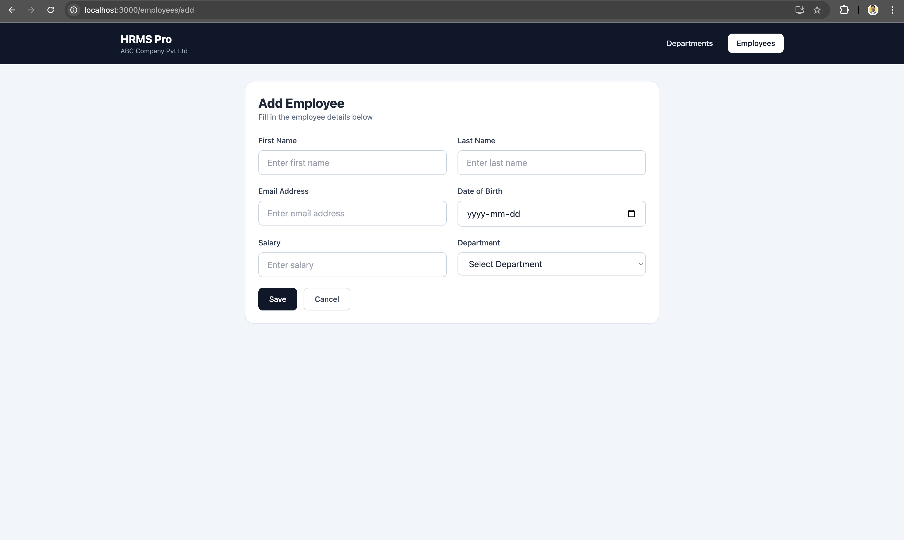
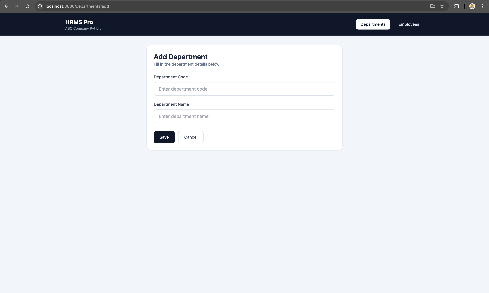
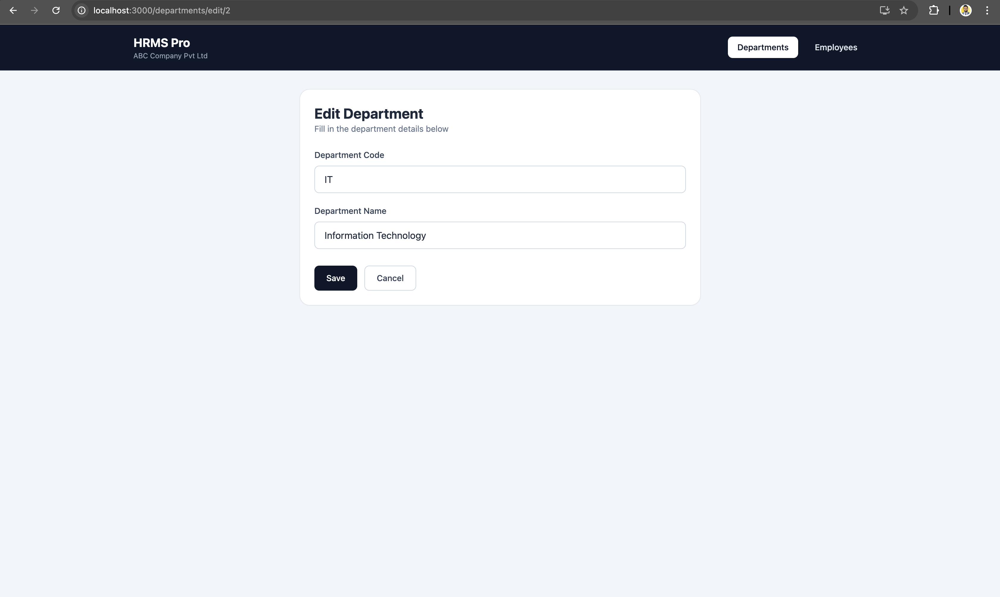
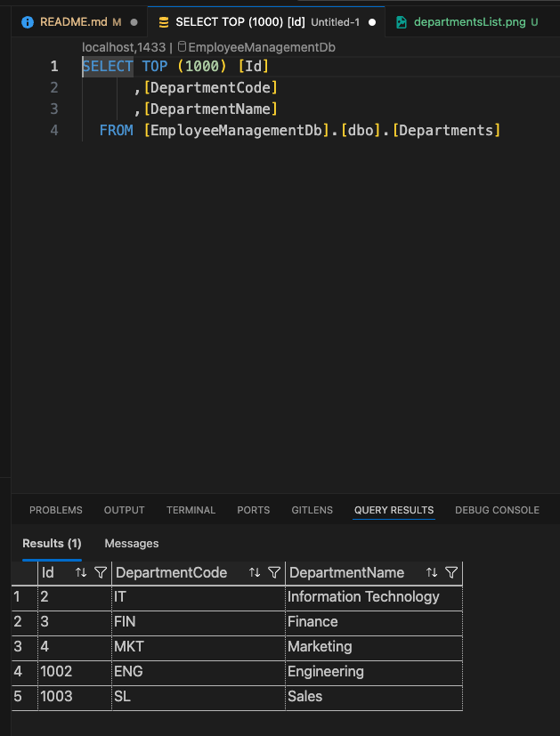
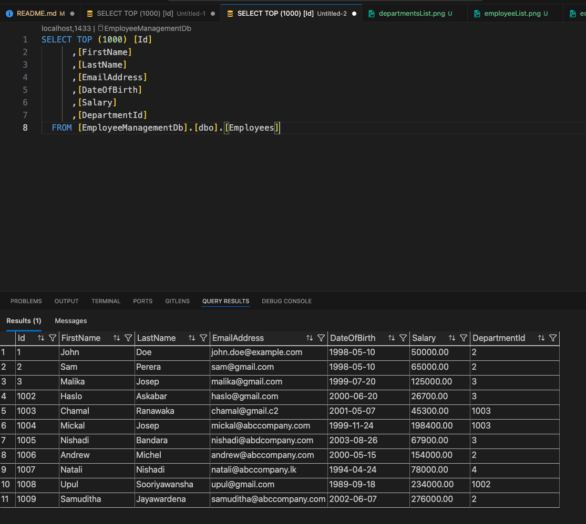

#  Pacific Kode Assignment - Employee Management System

A full-stack Employee Management System built using **React**, **ASP.NET Core Web API**, **SQL Server**, and **ADO.NET**.

This project demonstrates modern full-stack development practices including:

* Clean architecture
* API-driven design
* Reusable UI components
* Backend best practices

---

#  Overview

The system allows users to manage:

* Departments
* Employees

It supports full CRUD operations with validation, pagination, and structured API responses.

---

#  System Architecture

```
Frontend (React + Tailwind)
        ↓
REST API (ASP.NET Core Web API)
        ↓
Database (SQL Server)
```

---

# Features

## 🔹 Department Module

* Add new departments
* View all departments
* Edit department details
* Delete departments

## 🔹 Employee Module

* Add employees
* View employees (with pagination)
* Edit employee details
* Delete employees

## 🔹 Additional Features

* Employee age calculated from Date of Birth
* Server-side pagination
* Global exception handling
* Form validation (frontend + backend)
* Reusable UI components
* Clean UI with Tailwind CSS

---

# 🛠️ Technologies Used

## Frontend

* React
* React Router DOM
* Axios
* Tailwind CSS

## Backend

* ASP.NET Core Web API
* ADO.NET
* Microsoft.Data.SqlClient

## Database

* SQL Server (Docker)

## Tools

* Visual Studio Code
* MSSQL Extension
* Docker Desktop
* Postman

---

# 📁 Project Structure

## Backend

```
EmployeeManagement.API/
  Controllers/
  Middleware/
  Models/
  Repositories/
  Program.cs
  appsettings.json
```

## Frontend

```
employee-management-ui/
  src/
    api/
    components/
    pages/
    services/
    App.js
    index.js
    index.css
  .env
```

---

# ⚙️ Setup Instructions

## Backend Setup

```bash
cd EmployeeManagement.API
dotnet restore
dotnet run
```

Update `appsettings.json`:

```json
{
  "ConnectionStrings": {
    "DefaultConnection": "Server=localhost,1433;Database=EmployeeManagementDb;User Id=sa;Password=YourPassword123!;TrustServerCertificate=True;Encrypt=False"
  }
}
```

---

## Frontend Setup

```bash
cd employee-management-ui
npm install
npm start
```

Create `.env`:

```env
REACT_APP_API_BASE_URL=http://localhost:5115/api
```

---

# 🗄️ Database Setup

## Run SQL Server via Docker(MacBook)

```bash
docker run -e "ACCEPT_EULA=Y" -e "SA_PASSWORD=YourPassword123!" -p 1433:1433 --name sqlserver -d mcr.microsoft.com/mssql/server:2019-latest
```

## Create Database

```sql
CREATE DATABASE EmployeeManagementDb;
GO

USE EmployeeManagementDb;
GO
```

## Create Tables

```sql
CREATE TABLE Departments (
    Id INT PRIMARY KEY IDENTITY(1,1),
    DepartmentCode NVARCHAR(50),
    DepartmentName NVARCHAR(100)
);

CREATE TABLE Employees (
    Id INT PRIMARY KEY IDENTITY(1,1),
    FirstName NVARCHAR(100),
    LastName NVARCHAR(100),
    EmailAddress NVARCHAR(150),
    DateOfBirth DATE,
    Salary DECIMAL(18,2),
    DepartmentId INT,
    FOREIGN KEY (DepartmentId) REFERENCES Departments(Id)
);
```

---

# 🔗 API Endpoints

## Department APIs

* `GET /api/department`
* `GET /api/department/{id}`
* `POST /api/department`
* `PUT /api/department/{id}`
* `DELETE /api/department/{id}`

## Employee APIs

* `GET /api/employee?pageNumber=1&pageSize=10`
* `GET /api/employee/{id}`
* `POST /api/employee`
* `PUT /api/employee/{id}`
* `DELETE /api/employee/{id}`

---

# 🖥️ UI Screens

## 🔹 Navigation

* Top navbar to switch between modules

## 🔹 Department List

* Displays departments
* Edit/Delete actions

## 🔹 Department Form

* Add/Edit department

## 🔹 Employee List

* Table view
* Pagination support

## 🔹 Employee Form

* Input fields
* Department dropdown

---


# ✅ Validation Rules

## Department

* Code required
* Name required

## Employee

* First name required
* Last name required
* Valid email required
* DOB cannot be future
* Salary > 0
* Department required

---

# 📸 Screenshots

## Departments


## Employees


## Employee Form


## Department Form


## Edit Employee


## Edit Department


## Database Tables



```

---

# 🚀 Future Improvements

* Search & filtering
* Toast notifications
* Loading spinners
* DTO pattern
* Authentication (JWT)
* Unit testing
* Deployment (Azure / Vercel)

---

# 👨‍💻 Author

**Samuditha Jayawardena**

---

